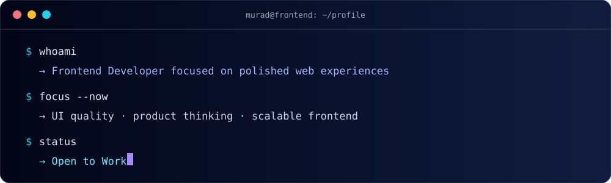
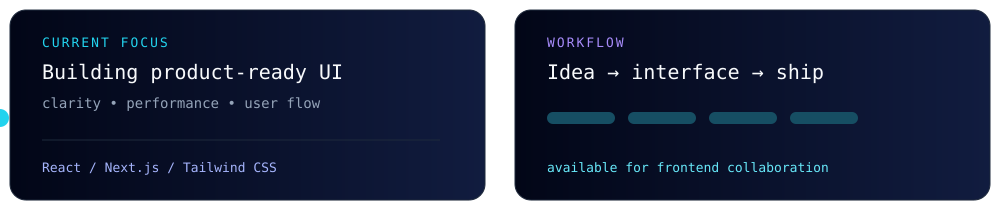
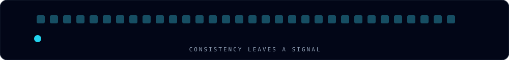

<!-- Hand-crafted profile: original SVG motion and interface visuals in /assets. -->

<div align="center">
  
</div>

<div align="center">
  
  <br /><br />
  
  
  
  
</div>

<br />

<br />

## ◈ &nbsp;`$ murad --profile`

<div align="center">
  
</div>

<br />

> I build polished frontend experiences with strong structure, modern tooling, and a product-first mindset.

**Current focus:** sharper UI quality, stronger product thinking, better frontend scalability, and better implementation detail.

```ts
const murad = {
  role: "Frontend Developer",
  location: "Baku, Azerbaijan",
  status: "Open to Work",
  strengths: ["Clean UI", "Responsive Layouts", "Modern Frontend Tooling"],
  currentStack: ["React", "Next.js", "Tailwind CSS"],
};
```


## ✦ &nbsp;`<BuildKit />`

<div align="center">
  
  <br /><br />
  
  <br />
  
  <br />
  
  <br />
  
</div>

<br />

| Focus now | What it means |
| :-- | :-- |
| `01 / UI quality` | Interfaces that look refined and feel intuitive |
| `02 / Product thinking` | Clear experiences that solve the right problem |
| `03 / Scalability` | Structured, maintainable frontend solutions |


## ▣ &nbsp;`<SelectedWork />`

### 01 — Gala Garden Cinema

> **Open-air cinema platform** with a responsive experience, movie exploration, food ordering, and Telegram Bot API-powered real-time notifications.<br />
> `React` · `Frontend workflows` · `Telegram Bot API` · [View live project →](https://galagardencinema.site/)

### 02 — Admin Dashboard

> **Dynamic management dashboard** with strong layout structure, API integration, and clean data visualization.<br />
> `React` · `Ant Design` · `Tailwind CSS` · `Axios` · `Recharts` · [View live project →](https://admin-dashboard-rust-six-97.vercel.app/)

### 03 — Foodie

> **Food delivery landing page** with clear visual hierarchy, strong UI sections, and smooth frontend interaction.<br />
> `React` · `Tailwind CSS` · `Redux Toolkit` · [View live project →](https://foodie-react-one.vercel.app/)

### 04 — HəllVar

> **A service platform** that offers customers fast, convenient, and reliable support for home and technical needs. It brings together skilled workers, home services, and IT/technical services in one place.<br />
> [View live project →](https://hell-var.vercel.app/)


## ◌ &nbsp;`<GitHubPulse />`

<div align="center"></div>

<br />

<div align="center">
  
</div>

<div align="center"></div>


## ⌘ &nbsp;`<OpenFor />`

<div align="center">
  
  
  
</div>

<br />

I am interested in frontend roles where product quality and user experience matter, collaborative work with modern React and Next.js teams, and projects that value clean design implementation with maintainable code.

I grow through real products, experimentation, and continuous shipping.

<details>
  <summary><b>One small frontend truth</b> ✦</summary>
  <br />

  ```js
  const greatInterface = [
    "clear before clever",
    "responsive by default",
    "fast enough to feel invisible",
  ];
  ```

  <sub>A good interface should make the next action feel obvious.</sub>
</details>


## ✉ &nbsp;`<Connect />`

<div align="center">
  <p>Have a frontend role, project, or idea in mind? Let’s make it feel premium.</p>
  <a href="mailto:murad.feteliyev.2020@gmail.com"></a>
  <a href="https://www.linkedin.com/in/mourad-fatalief"></a>
  <a href="https://github.com/fatalieff"></a>
  <br /><br />
  <sub>Hand-crafted with original SVG motion, interface details, and a lot of curiosity.</sub>
</div>

<br />
<div align="center"></div>
